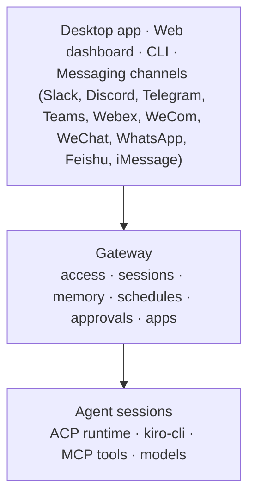

<p align="center">
  
</p>

<h1 align="center">Kiro Crew</h1>

<p align="center">
  <strong>A persistent workspace for development work that self-improves and continues beyond one session.</strong>
</p>

<p align="center">
  <a href="https://trendshift.io/repositories/103032" target="_blank" rel="noopener noreferrer"></a>
</p>

<p align="center">
  Kiro Crew is an open source development workspace that runs locally or remotely on
  your hardware. It is persistent, self-learning, and self-evolving. Work with it
  from the desktop app, web dashboard, and CLI, or continue the same work through
  connection tools like Slack and Discord.
  Your multi-step tasks can run unattended, recurring jobs run on your schedule,
  and heartbeats monitor systems until something needs attention. Kiro Crew Apps
  tailor that experience to a specific job, combining a purpose-built interface
  with agents, skills, schedules, integrations, and backend services.
</p>

<p align="center">
  <a href="https://github.com/kirodotdev/KiroCrew/releases"></a>
  <a href="docs/README.md"></a>
  <a href="docs/guides/install.md"></a>
  <a href="CONTRIBUTING.md"></a>
  <a href="SECURITY.md"></a>
  <a href="LICENSE"></a>
</p>

<p align="center">
  <a href="#quick-start">Quick start</a> ·
  <a href="#build-from-source">Build from source</a> ·
  <a href="#why-kiro-crew">Why Kiro Crew</a> ·
  <a href="#what-kiro-crew-does">Capabilities</a> ·
  <a href="#how-it-works">How it works</a> ·
  <a href="#security-and-control">Security</a> ·
  <a href="#install-configure-and-operate">Install</a> ·
  <a href="#anonymous-usage-telemetry">Telemetry</a> ·
  <a href="#docs-and-contributing">Docs</a>
</p>

## Quick start

You choose how to run Kiro Crew: the desktop app with automatic updates, a
one-line install on your machine or a remote host, the Docker image for
always-on servers, or a build from source. The default agent runs on
`kiro-cli`, which you install and sign in to separately. First launch checks
that prerequisite and links to the official setup guide when it is missing.

### App downloads

The desktop app starts a bundled Gateway when no local Gateway is already
running, updates itself on the channel you download, and can connect to a
remote Gateway over an SSH tunnel. See the
[desktop app guide](docs/build/desktop-app.md).

- **macOS** (Apple Silicon/Intel): [Stable](https://download.crew.kiro.dev/desktop/stable/latest/KiroCrew.dmg) | [Insider](https://download.crew.kiro.dev/desktop/insider/latest/KiroCrew.dmg) | [Nightly](https://download.crew.kiro.dev/desktop/nightly/latest/KiroCrew.dmg)
- **Windows** (x64): [Stable](https://download.crew.kiro.dev/desktop/stable/latest/KiroCrew-Setup.exe) | [Insider](https://download.crew.kiro.dev/desktop/insider/latest/KiroCrew-Setup.exe) | [Nightly](https://download.crew.kiro.dev/desktop/nightly/latest/KiroCrew-Setup.exe)

**On Linux, start with the one-line install** — it is the smoothest path, works
on every distro and both architectures, and puts `kirocrew` on your `PATH`,
which is what makes `kirocrew service install` (and the AppArmor profile the
agent sandbox needs on Ubuntu 23.10+) reachable:

```bash
curl -fsSL https://download.crew.kiro.dev/cli.sh | sh
```

You then work in the dashboard at `http://localhost:5476`. Add a **desktop
package** when you want what only the Electron shell gives you: an
application-menu entry and icon, a native window, a taskbar badge, a system-wide
hotkey, a Gateway that starts and stops with the app, and in-app updates. A
`.deb` or `.rpm` installs to a fixed path under `/opt`, which is what lets it set
the AppArmor profile up for you; the AppImage needs no root but needs FUSE and
carries a manual sandbox step. `uname -m` prints which architecture you need.

| Linux desktop package | x86_64 | aarch64 (Graviton, Raspberry Pi, ARM laptops) |
|---|---|---|
| **`.deb`** (Debian, Ubuntu) | [Stable](https://download.crew.kiro.dev/desktop/stable/latest/KiroCrew-x86_64.deb) · [Insider](https://download.crew.kiro.dev/desktop/insider/latest/KiroCrew-x86_64.deb) · [Nightly](https://download.crew.kiro.dev/desktop/nightly/latest/KiroCrew-x86_64.deb) | [Stable](https://download.crew.kiro.dev/desktop/stable/latest/KiroCrew-aarch64.deb) · [Insider](https://download.crew.kiro.dev/desktop/insider/latest/KiroCrew-aarch64.deb) · [Nightly](https://download.crew.kiro.dev/desktop/nightly/latest/KiroCrew-aarch64.deb) |
| **`.rpm`** (Fedora, RHEL, CentOS Stream, Amazon Linux 2023) | [Stable](https://download.crew.kiro.dev/desktop/stable/latest/KiroCrew-x86_64.rpm) · [Insider](https://download.crew.kiro.dev/desktop/insider/latest/KiroCrew-x86_64.rpm) · [Nightly](https://download.crew.kiro.dev/desktop/nightly/latest/KiroCrew-x86_64.rpm) | [Stable](https://download.crew.kiro.dev/desktop/stable/latest/KiroCrew-aarch64.rpm) · [Insider](https://download.crew.kiro.dev/desktop/insider/latest/KiroCrew-aarch64.rpm) · [Nightly](https://download.crew.kiro.dev/desktop/nightly/latest/KiroCrew-aarch64.rpm) |
| **AppImage** (no root, any distro) | [Stable](https://download.crew.kiro.dev/desktop/stable/latest/KiroCrew-x86_64.AppImage) · [Insider](https://download.crew.kiro.dev/desktop/insider/latest/KiroCrew-x86_64.AppImage) · [Nightly](https://download.crew.kiro.dev/desktop/nightly/latest/KiroCrew-x86_64.AppImage) | [Stable](https://download.crew.kiro.dev/desktop/stable/latest/KiroCrew-aarch64.AppImage) · [Insider](https://download.crew.kiro.dev/desktop/insider/latest/KiroCrew-aarch64.AppImage) · [Nightly](https://download.crew.kiro.dev/desktop/nightly/latest/KiroCrew-aarch64.AppImage) |

```bash
sudo apt install ./KiroCrew-x86_64.deb     # Debian, Ubuntu
sudo dnf install ./KiroCrew-x86_64.rpm     # Fedora, RHEL, CentOS Stream, AL2023
```

The Linux desktop app needs **glibc 2.34 or newer** (Ubuntu 22.04+, Debian 12+,
Fedora, CentOS Stream 9, Amazon Linux 2023). On an older host — Ubuntu 20.04,
Debian 11, Amazon Linux 2 — use the one-line install above.

Every architecture below is a first-class lane: each gets its own build, its own
auto-update feed, and its own SLSA provenance attestation.

| Install path | x86_64 | aarch64 (ARM64) |
|---|---|---|
| **CLI one-liner / wheel** | yes | yes (the wheel is `py3-none-any`; native libraries are vendored per architecture) |
| **Desktop `.deb` / `.rpm` / AppImage** | yes | yes |
| **Docker image** | yes | yes (`linux/amd64` and `linux/arm64` under every tag, so `docker pull` picks yours) |

Take Stable unless you have a reason not to — the table below says who each
channel is for.

### Release channels

Every install path — desktop app, CLI, Docker image — offers the same three
channels. Pick by how much churn you can absorb, not by version number:

| Channel | Who it's for | Built from | Cadence |
|---------|--------------|------------|---------|
| **Stable** | Everyone. The default on every install path. | The Insider build that baked long enough to be promoted | On promotion, no calendar commitment |
| **Insider** | Power users who want features days to weeks early and accept the new bugs that come with them | Release-branch release-candidate tags | Every RC |
| **Nightly** | Us and contributors. Untested `main` HEAD — expect breakage. | `main`, 06:00 UTC daily | Daily |

Stable and Insider are two update lanes of the **same** app. The desktop app
switches between them in Settings → About, a CLI install switches by re-running
the installer with `--channel`, and a container switches by pulling a different
tag. Either way, the other lane's current version then arrives as an ordinary
update.

Because they are one app, keeping a Stable *and* an Insider copy side by side
does not give you two independent installs. Both read the same desktop settings
store, so the channel is a single value and whichever copy wrote it last wins —
switch to Insider in one and the other follows. They share one update download
cache as well. `KIROCREW_HOME` does not separate them either: it moves the data
home, not the desktop settings.

Nightly is a separate app with its own name and icon, so it installs *alongside*
a Stable or Insider one rather than replacing it. That also makes it the one copy
that keeps its own channel and its own settings store. It is not a sandbox,
though: it reads the same `~/.kiro/crew` data home unless you point it elsewhere
with `KIROCREW_HOME`.

Running Insider or Nightly is a real contribution. When something looks wrong,
please [open an issue](https://github.com/kirodotdev/KiroCrew/issues) so it gets
fixed before it reaches Stable.

### One-line install

Install the prebuilt, SHA-256-verified wheel from the release CDN without
cloning the repository or running `npm` and a local build.

Stable, the default:

```bash
curl -fsSL https://download.crew.kiro.dev/cli.sh | sh
```

Track a faster channel, `insider` or `nightly` (see
[Release channels](#release-channels) for who each one is for):

```bash
curl -fsSL https://download.crew.kiro.dev/cli.sh | sh -s -- --channel insider
```

Pin an exact version:

```bash
curl -fsSL https://download.crew.kiro.dev/cli.sh | sh -s -- --version 0.1.0
```

**Managed Python by default.** The installer runs Kiro Crew on a fully managed
Python instead of the system one: it fetches a SHA-256-pinned
[uv](https://docs.astral.sh/uv/) and provisions a self-contained CPython 3.12
into `~/.kiro/crew-python`, so the install never depends on (or breaks with)
the system interpreter. Existing installs migrate the next time this installer
itself runs — a staged update applied from the dashboard or the CLI's update
command keeps its current interpreter. To run
on the system interpreter instead:

```bash
curl -fsSL https://download.crew.kiro.dev/cli.sh | sh -s -- --system-python
```

The choice is sticky: it is recorded next to the channel, so later re-runs of
the installer keep it without
the flag. Opt back in with `--managed-python`. If the managed interpreter
cannot be downloaded (no network path to the mirror), the installer falls back
to a usable system Python 3.12+ for that run; point air-gapped hosts at a
mirror with `KIROCREW_UV_URL` (the uv tarball) and `UV_PYTHON_INSTALL_MIRROR`
(the interpreter archive).

Open `http://localhost:5476` and start a conversation. The web dashboard works
without messaging credentials. Add a messaging channel —
[Slack](docs/guides/slack-setup.md),
[Discord](src/kiro_crew/docs/discord-integration.md),
[Telegram](src/kiro_crew/docs/telegram-integration.md),
[Teams](src/kiro_crew/docs/teams-integration.md),
[Webex](src/kiro_crew/docs/webex-integration.md),
[WeCom](src/kiro_crew/docs/wecom-integration.md),
[WeChat](src/kiro_crew/docs/weixin-integration.md),
[WhatsApp](src/kiro_crew/docs/whatsapp-integration.md),
[Feishu](src/kiro_crew/docs/feishu-integration.md), or
[iMessage](src/kiro_crew/docs/imessage-integration.md) — when you want to continue
working with the same agent away from the dashboard. Apart from Teams (which
needs a public HTTPS webhook — see its guide) and iMessage (which talks to
Messages.app on the same Mac), these channels connect
outbound, so you do not need to expose the dashboard port publicly.

### Docker

For always-on servers, the Gateway ships as a public multi-arch image on GHCR:

```bash
docker run -d --name kirocrew \
  -p 127.0.0.1:5476:5476 \
  -v kirocrew-home:/home/kirocrew \
  ghcr.io/kirodotdev/kirocrew:stable
```

See the [Docker guide](docs/guides/docker.md) for first-run login, channel tags, and
the container security model.

### Build from source

macOS and Linux require Python 3.12+, Node.js 22+ (24 LTS recommended), npm, and
[`kiro-cli`](https://kiro.dev/docs/cli/). Install Kiro CLI on the Gateway host
and run `kiro-cli login` separately before using chat. The first desktop or
dashboard launch checks this prerequisite and links to the official setup
guide when it is missing. Windows is supported through a native source install;
follow the [Windows guide](docs/guides/windows-install.md) instead of the shell
steps below.

```bash
# 1. Clone and build Kiro Crew
git clone https://github.com/kirodotdev/KiroCrew.git
cd KiroCrew
make build
source .venv/bin/activate

# 2. Configure, verify, and start
kirocrew setup
kirocrew doctor
kirocrew gateway
```

## Why Kiro Crew

Most agent sessions end when the chat closes. Kiro Crew runs continuously on
hardware you control and keeps working between conversations.

**Persistent.** Sessions, memory, schedules, and task checkpoints survive
Gateway restarts, and scheduled or reactive work continues without someone at
the terminal.

**Self-learning.** Corrections and task failures become durable lessons.
Preferences and project context carry into new sessions.

**Self-evolving.** Repeated patterns become reusable skills. Memory, lessons,
and skills stay visible and editable, so each Kiro Crew grows more tailored to
the person and work around it.

**Runs where you choose.** Your Mac, a local container, or a remote machine
you control.

**One Gateway, many surfaces.** Work directly in the desktop app or web dashboard,
or continue the same work from the CLI and messaging surfaces like Slack and
Discord.

## What Kiro Crew does

| Capability | What it gives you |
|---|---|
| **Persistent sessions** | Run concurrent, isolated conversations, resume them after Gateway restarts, search prior sessions, and carry recent context into new work. |
| **Self-learning** | Turn corrections and task failures into durable lessons that change later behavior. Keep preferences, active-project context, and history scoped to the relevant workspace. Say *"no, always run the frontend checks before calling a change done"* and it becomes a workspace-scoped lesson applied in future sessions. |
| **Self-evolving skills** | Synthesize reusable skills from repeated patterns, then inspect, refine, or remove them as your work changes. |
| **Long-running tasks** | Give Kiro Crew a task spec and walk away. It plans steps, executes them, validates results, retries failures, and resumes from checkpoints. *"Implement this migration plan and stop if the tests fail"* runs as a checkpointed task with validation at each step. |
| **Unattended autonomy** | Run scheduled agent work or deterministic scripts and commands without a model call. Monitor work until it is done, or react to messaging events and authenticated webhooks without someone at the terminal. *"Every weekday at 9, summarize the open work I should review"* becomes a timezone-aware recurring job delivered to the surface you choose. |
| **Delegation** | Spawn isolated subagents for parallel work and bring their results back into the parent conversation. *"Research these three options in parallel and recommend one"* fans out to isolated subagents and synthesizes the tradeoffs. |
| **Work where you choose** | Work directly in the desktop app or web dashboard, or continue through the CLI and any connected messaging surface without moving the agent runtime or its state. |
| **Installable Apps** | Add focused interfaces and domain workflows through dashboard pages, scoped Gateway APIs, events, and lifecycle hooks. |
| **Extensible tools** | Add MCP servers, markdown skills, and hooks without changing the core runtime. |
| **Visible execution** | Watch tool calls, subagent progress, context usage, approvals, schedules, memory, and logs from the dashboard. |
| **Defense in depth** | Combine tool approvals, OS sandboxing, sensitive-path checks, credential redaction, deny rules, audit events, and governance profiles. |

You can also paste a screenshot and ask what is causing an error. Kiro Crew sends
the image to the active Kiro model and keeps the diagnosis in the conversation
history.

The complete inventory is in [Features](src/kiro_crew/docs/index.md) and
[What's New](CHANGELOG.md).

## How it works



The Gateway separates where the agent runs from where you work with it. In the
desktop app or web dashboard, you can work directly through parallel conversations,
files, task runs, approvals, memory, and apps. From the CLI or any connected
messaging channel, the Gateway routes your work to managed agent sessions under
the same memory, tool, approval, and policy services. Apps extend the dashboard and
Gateway APIs with focused workflows.

Each active conversation or background task uses an agent session. Its session
provider drives `kiro-cli` over ACP, streams model and tool events, and preserves
conversation state. Depending on the workload, a session is backed by its own
ACP process or by a session handle on a shared multiplexed ACP runtime. The
Gateway manages these sessions along with scheduling, approvals, memory,
security policy, messaging connections, and the dashboard.

The current runtime places the Gateway, agent sessions, ACP processes, and state
on the same host. Run Kiro Crew on your Mac, inside a container on your machine,
or on a remote Linux host you control. Conversation history, memory, and
knowledge indexes remain on that host. Model requests are handled by `kiro-cli`
and follow the account and model configuration you use there.

**Gateway.** The Gateway is the long-running Kiro Crew process. It routes
messages from the desktop app, web, CLI, and the messaging surfaces listed below. It persists
session state, injects memory and skills, starts scheduled work, coordinates
subagents, brokers approvals, enforces runtime policy, and exposes activity in
the dashboard.

**Agent sessions.** A dashboard conversation, Slack thread, or Discord DM maps to
an isolated agent session. Scheduled jobs, task runs, other messaging-channel
conversations, and subagents also use managed sessions. These sessions preserve
conversation context and can run concurrently before returning results to a
parent session or configured surface.

**ACP runtime and turns.** Kiro Crew supports both a dedicated `kiro-cli` ACP
process for a session and a shared ACP runtime that multiplexes multiple session
handles. During each turn, the session sends a prompt, streams model and tool
events, resolves approvals, and returns the final result. An agent session is a
logical isolation boundary, not necessarily one OS process.

**Use the surface that fits the moment.**

| Surface | Best for |
|---|---|
| **Desktop app** | The simplest local experience, with a bundled Gateway plus multi-tab connections to local or remote Gateways. |
| **Web dashboard** | Parallel conversations, files, approvals, activity, memory, schedules, apps, settings, and system status at `localhost:5476`. |
| **Slack** | Work from DMs and threads with streaming replies, approvals, notifications, and session links back to the dashboard. |
| **Telegram** | Reach your agent from private DMs on your phone or laptop, with streaming replies, inline approvals, and commands. |
| **Discord** | Work from DMs with streaming replies and approvals delivered as message buttons. |
| **Teams** | Reach your agent from Microsoft Teams chats — replies arrive as complete messages, and approvals are answered by typing. |
| **Webex** | Work from Webex direct messages with inline approvals; progress shows as edits to one message, which the finished answer replaces. |
| **WeCom** | Chat through an outbound-connected WeCom AI bot with configured user access and streaming replies. |
| **WeChat (Weixin)** | Reach your agent from WeChat with configured user access; a typing indicator runs while the turn works and the reply arrives as complete messages. |
| **WhatsApp** | Reach your agent from WhatsApp with streaming replies, file exchange, and reactions. |
| **Feishu (Lark)** | Chat from Feishu DMs and allow-listed group chats through a custom app bot on an outbound long connection — replies arrive as complete messages. |
| **iMessage** | Chat from the Messages app on your own Mac and Apple devices, with no bot to register and no token to paste — replies arrive as complete messages. |
| **CLI** | Fast interactive chat and direct automation with `kirocrew chat`, `run`, `cron`, `spawn`, and `security`. |

**Choose how work starts.**

| Mode | Use it for | Entry point |
|---|---|---|
| **Scheduled** | Briefings, audits, backups, and recurring maintenance | `kirocrew cron` or a natural-language request |
| **Proactive** | Goals that need another pass without waiting for a new user message | AutoNudge and goal-loop skills |
| **Reactive** | CI alerts, external automation, messaging-channel activity, and other events | Authenticated agent webhooks and messaging events |
| **Task runner** | Bounded projects with explicit steps, tests, review, and checkpoint resume | `kirocrew run TASK.md` |
| **Subagents** | Independent workstreams that can run concurrently | `kirocrew spawn run "task"` |

**Memory, learning, and evolution.** Kiro Crew maintains preferences, active
project context, decaying history summaries, and durable lessons. Corrections
and task failures can change later behavior, while repeated patterns can become
reusable skills. In-process embeddings add semantic retrieval for memory and
the knowledge library. The stored state remains inspectable and editable
from the dashboard. Incognito and temporary session modes let you opt out when
a conversation should not persist.

**Skills, MCP, and apps.** Markdown skills supply reusable workflows and can be
loaded only when relevant. The built-in `kirocrew-core`, `kirocrew-cron` and
`kirocrew-computer` MCP servers expose task, subagent, learning, messaging,
scheduling, and desktop-automation tools. You
can discover additional MCP servers from Kiro or Kiro Crew configuration. The
App Kit adds installable interfaces and domain workflows. Apps can add dashboard
pages, use scoped Gateway APIs, subscribe to events, and register lifecycle
hooks.

## Security and control

Kiro Crew gives an AI agent real tool access, so the controls are enforced at
the runtime boundary instead of relying only on prompt instructions.

- **Local by default.** The dashboard binds to loopback unless you explicitly
  configure a network URL. Remote dashboards require token authentication.
- **Interactive approvals.** Review tool requests in the dashboard or a
  connected messaging channel like Slack, Discord, or Telegram.
  Session-scoped trust can reduce repeated prompts without changing
  the underlying deny and sensitive-path controls.
- **OS sandbox.** On Linux and macOS, `kiro-cli` can run inside namespace or
  Seatbelt isolation. Standard, strict, and off modes make the tradeoff
  explicit. Windows offers no equivalent OS-level layer, so Kiro Crew fails
  closed there: agent subprocesses are refused rather than run unconfined, until
  you declare the
  [`sandbox_allow_unsandboxed_exec` opt-in](docs/guides/windows-install.md#the-unsandboxed-exec-opt-in).
- **Sensitive data guards.** Kiro Crew blocks direct access to protected paths,
  strips sensitive environment variables, and redacts credential patterns from
  output before it reaches a chat surface.
- **Denied operations.** A bundled catalog of deny rules blocks destructive commands and
  common exfiltration paths even when a session has broad approval.
- **Auditability.** Security events and tool activity are recorded for review.
  Use `kirocrew security events`, `audit`, and `verify` to inspect them.
- **Governance ceiling.** Optional policy and profile files compose with a
  tightest-wins model. A running app or agent can narrow the allowed scope but
  cannot loosen the enterprise ceiling. Inspect it with `kirocrew policy show`,
  `validate`, and `explain`.

No agent security layer removes the need to protect credentials and review
high-impact actions. Avoid pasting secrets or sensitive personal data into a
chat. Read the [security architecture](docs/architecture/security-deep-dive.md) and use
[SECURITY.md](SECURITY.md) for private vulnerability reporting.

## Install, configure, and operate

**Installer details.** The installer verifies the wheel's SHA-256, installs through `pipx` or a
managed virtual environment, and records the channel — `stable`, `insider`, or
`nightly` — in `~/.kiro/crew/channel`. On Linux and macOS it provisions its own
CPython 3.12 by default from a SHA-256-pinned `uv`; `--system-python` opts out
and the choice is sticky across updates. The mechanics, the env vars that
override each path, and the two `pip` forms for a published wheel (channel
index, or one wheel pinned by hash) are in
[Installing and Building](docs/guides/install.md#c-self-contained-pip-wheel).

**Semantic memory.** Semantic memory needs no setup. Embeddings run in-process, and the Gateway
downloads its embedding model in the background on first start, verifies it,
and stores it under `~/.kiro/crew/models`. Until the model lands, memory search
falls back to keyword search and picks up embeddings automatically without a
restart. Set `KIROCREW_EMBED_MODEL_URL` to point at a mirror for airgapped
installs.

See [Installing and Building](docs/guides/install.md) for wheels, desktop builds,
Windows, optional voice dependencies, and manual setup.

**Choose where Kiro Crew runs.** The current deployment model keeps the Gateway,
agent session runtime, ACP processes, and state together on one host. Your Apps
and chat surfaces connect to that Gateway.

| Deployment | How to run it | Where Kiro Crew and its state live |
|---|---|---|
| **Mac app, local** | Install or build the desktop app with `make desktop` | The app starts its bundled Gateway. Agent sessions, ACP processes, and `~/.kiro/crew` stay on your Mac. |
| **Native local** | `make build`, or install a wheel from `make wheel` | The Gateway and agent runtime run directly on your macOS, Linux, or Windows machine. |
| **Local container** | Run `ghcr.io/kirodotdev/kirocrew` and persist `/home/kirocrew` | The Gateway and agent runtime run inside the official multi-arch container on your machine. |
| **Remote hardware** | Follow the [remote host guide](docs/guides/remote-and-mobile.md) and install the service | The Gateway, agent sessions, and state run continuously on your Linux server, home lab, or cloud instance. Connect the desktop app or browser through an SSH tunnel. |
| **Windows source install** | Follow [the Windows guide](docs/guides/windows-install.md) | The Gateway, agent sessions, chat, cron, and dashboard run natively with documented feature limits. |

For containers, mount the directory selected by `KIROCREW_HOME` so sessions,
configuration, memory, and credentials survive replacement. Keep the Gateway
port bound to loopback unless you intentionally configure authenticated remote
access. Container isolation and the Kiro Crew OS sandbox are separate layers
and depend on the host runtime configuration. See the
[Docker guide](docs/guides/docker.md) for the published image and deployment details.

**Keep it running.** Install a systemd service on Linux or a launchd agent on
macOS:

```bash
kirocrew service install
kirocrew service status
kirocrew logs
```

To bind a non-default port (for example a host where `5476` is already taken),
set `KIROCREW_PORT` when you install the service — the value is baked into the
unit:

```bash
KIROCREW_PORT=5477 kirocrew service install
```

To change it later without reinstalling, edit `/etc/kirocrew/kirocrew.env`
(created by `service install`) and run `sudo systemctl restart kirocrew`. Units
installed by releases before v0.2.0 lack the `EnvironmentFile=` directive that
reads this file — re-run `kirocrew service install` or use a systemd drop-in;
see [the install guide](docs/guides/install.md#setting-the-service-port).

The desktop app can use this local Gateway or connect to a remote one. For an
always-on VPS, home server, or cloud VM in your account, follow the
[remote host guide](docs/guides/remote-and-mobile.md). Kiro Crew does not require a
Kiro Crew-hosted control plane.

**Configure it.** User data lives under `~/.kiro/crew` by default. Manage the
main configuration with `kirocrew config get`, `set`, and `edit`.

```json
{
  "agent": {
    "provider": "acp",
    "approval_mode": "interactive",
    "sandbox": "auto"
  },
  "session": {
    "timeout_secs": 1800,
    "pool_size": 2
  },
  "dashboard": {
    "bot_name": "Kiro Crew"
  }
}
```

`agent.provider` is fixed to `acp`. Kiro Crew drives `kiro-cli` over the Agent
Client Protocol. Set the dashboard port with `KIROCREW_PORT` or
`kirocrew gateway --port <n>`. Messaging-channel credentials (Slack, Discord,
Telegram, and the rest) live in `~/.kiro/crew/.env` rather than the JSON config.

**Troubleshoot quickly.** Start with `kirocrew doctor`. For an ACP timeout,
confirm `kiro-cli` is on `PATH` and logged in, then allow extra time for the
first MCP startup. For memory search, check that the embedding
model finished downloading under `~/.kiro/crew/models`. For a stale MCP configuration, run
`kirocrew setup --agent-only`, or add `--clean` to rebuild it.

**Find the logs.** When you need to debug, the fastest path is
`kirocrew logs` (tail the most recent gateway output) or `kirocrew logs -f` to
follow it live; `kirocrew logs -n 200` prints more history. `kirocrew logs`
reads the right source automatically — the systemd journal when the Linux
service is installed, the launchd stdout file on macOS, or the foreground
gateway log otherwise. Raise verbosity with `kirocrew gateway -v` (INFO:
session lifecycle and context usage) or `-vv` (DEBUG: full ACP events and
message traces); set the persistent default with
`kirocrew config set agent.log_level`, or change it at runtime from the
dashboard **Logs** page. Under `~/.kiro/crew` (or your `KIROCREW_HOME`) you can
also read the raw files directly:

| File | What it holds |
|---|---|
| `~/.kiro/crew/gateway.log` | Main gateway log when running in the foreground. |
| `~/.kiro/crew/security_events.jsonl` | Append-only security and tool-access events. Inspect with `kirocrew security events`, `audit`, and `verify`. |
| `~/.kiro/crew/audit.log` | Human-readable audit trail of privileged operations. |
| `~/.kiro/crew/subagents/<agent_id>/result.txt` | Full transcript of a completed subagent, kept for a grace window after it finishes. |

See the [Troubleshooting guide](src/kiro_crew/docs/troubleshooting.md) for the
full log-level reference and emergency recovery steps.

## Anonymous usage telemetry

Kiro Crew sends **one anonymous heartbeat per day** so maintainers can see how
many copies are actively running, which versions are in use, and which
platforms and install channels to support. After a successful install or update
from the official app catalog, it also sends one anonymous per-app receipt.
Both signals are on by default and use the same controls below.

To turn it off, flip **Settings → Privacy → Send anonymous usage heartbeat** in
the dashboard (the same switch appears on the last step of first-run
onboarding). Or from a terminal:

```bash
kirocrew telemetry disable        # persists to config.json
export KIROCREW_TELEMETRY_DISABLED=1   # or per-shell / per-container
kirocrew telemetry status         # print exactly what would be sent
```

The toggle and `kirocrew telemetry disable` write the same setting, so either
one sticks across restarts and upgrades. `KIROCREW_TELEMETRY_DISABLED` overrides
both — when it is set, the dashboard toggle is disabled and says so.

**Exactly these five fields are sent, at most once per day, and nothing else:**

| Field | Example | Why |
|-------|---------|-----|
| Random instance id | `9c75560d…` (UUID4) | Lets us count how many copies ran on a given day. Generated once on first run and derived from nothing — not your hostname, username, MAC, IP, or any account. It identifies an installed copy, never a person. |
| App version | `0.1.2` | Which releases are still in use. **Release number only** — build stamps like `-nightly.20260731t065756` are stripped before sending, because a per-build timestamp is near-unique and would help identify a specific machine. |
| Python minor version | `3.12` | When the minimum can move up |
| Install channel | `dmg` | Which install path people actually use |
| First-run flag | `1` / `0` | New installs vs returning |

**Official-app install receipts are separate and event-based.** After a
successful official-catalog install or update, Kiro Crew sends one GET to
`/b/1/install/<app-slug>?t=<token>&k=<fresh|update>&v=<release>` on the same
telemetry host. The slug is the public catalog identifier. `t` is the first 32
hex characters of HMAC-SHA256 keyed by the local beacon install id over
`app-install:<slug>`; the raw install id is never sent, and tokens for different
apps cannot be linked to assemble an installed-app profile. `k` separates fresh
installs from updates, and `v` is the same release-only Kiro Crew version clamp
used by the heartbeat.

Receipts are emitted only for bundled or edition-provided official catalog
entries. Apps from user-configured registries, local-directory installs, and
self-registered apps emit nothing, so private app names never leave the machine.
If no persistent beacon install id exists yet, the receipt is skipped.

This list used to be nine fields. Release channel, OS, CPU architecture and
governance posture were **removed** — each was coarse on its own, but the
instance id is stable, so those attributes all describe the *same* copy and
together they narrowed the group any one install blends into far more than any
single field suggests.

We report this as **Daily Active Crews** rather than "users": Kiro Crew has
no account system of its own, and the Kiro sign-in that `kiro-cli` uses for
model access is never read or sent. There is no way to resolve a copy to a
person, so one person running Kiro Crew on three machines counts as three
Crews.

**Never sent:** your prompts, model responses, file contents, file paths, repo
or branch names, credentials, environment variables, hostname, username, or IP
address. The receiving CDN is configured **not to log client IP addresses** — the
log delivery does not include that field, so no IP is stored at all.

**Automatically off** in CI, and whenever `KIROCREW_HOME` points somewhere other
than `~/.kiro/crew` (dev instances and pods are never counted).

**Enterprise administrators can pin it off entirely.** A `capabilities.telemetry`
entry in the security policy blocks both outbound signals regardless of the local
setting, and the dashboard toggle then says so instead of offering a change that
would not take effect:

```json
{"version": 1, "boot": {"fail_closed": true},
 "capabilities": {"telemetry": {"enabled": false}}}
```

See [docs/system-specs/modules/governance.md](docs/system-specs/modules/governance.md).

This is separate from `telemetry.enabled`, which controls **local-only**
performance metrics that never leave your machine. See
[docs/system-specs/modules/metrics.md](docs/system-specs/modules/metrics.md).

## Docs and contributing

| Topic | Start here |
|---|---|
| Install and packaging | [Install and build](docs/guides/install.md), [Windows](docs/guides/windows-install.md), [Docker](docs/guides/docker.md), [Desktop](docs/build/desktop-app.md), [Remote host](docs/guides/remote-and-mobile.md), [Release process](docs/build/release.md) |
| Product capabilities | [Features](src/kiro_crew/docs/index.md), [Skills](skills/README.md), [All user docs](src/kiro_crew/docs/README.md) |
| All documentation | [docs/](docs/README.md) for contributor and architecture docs |
| Channels | [Slack](docs/guides/slack-setup.md), [Discord](src/kiro_crew/docs/discord-integration.md), [Telegram](src/kiro_crew/docs/telegram-integration.md), [Teams](src/kiro_crew/docs/teams-integration.md), [Webex](src/kiro_crew/docs/webex-integration.md), [WeCom](src/kiro_crew/docs/wecom-integration.md), [WeChat (Weixin)](src/kiro_crew/docs/weixin-integration.md), [WhatsApp](src/kiro_crew/docs/whatsapp-integration.md), [Feishu (Lark)](src/kiro_crew/docs/feishu-integration.md), [iMessage](src/kiro_crew/docs/imessage-integration.md) |
| Architecture | [System architecture](docs/architecture/overview.md), [Memory](docs/system-specs/modules/memory-skills-hooks.md), [MCP](docs/architecture/mcp.md), [App Kit](docs/app-kit/getting-started.md) |
| Trust and dependencies | [Security](docs/architecture/security-deep-dive.md), [Security policy](SECURITY.md) |
| Project work | [Contributing](CONTRIBUTING.md), [Tenets](TENETS.md), [Governance](GOVERNANCE.md), [Maintainers](MAINTAINERS.md), [AI assistant rules](AGENTS.md), [Changelog](CHANGELOG.md) |

Contributions are welcome. Create a branch from `main`, keep changes focused,
and run the relevant checks before opening a pull request:

```bash
# Backend
pip install -e ".[voice]" --group dev
pytest

# Frontend
cd website
npm ci
npm run check
npm run build
```

Use [GitHub Issues](https://github.com/kirodotdev/KiroCrew/issues) for bugs and
feature requests. Do not file security vulnerabilities publicly.


## Contributors

Kiro Crew was made possible by its internal community, the people who supported the
project and shipped its code, together with everyone who has since opened a pull
request in the open. This is that founding group; as Kiro Crew grows in the open, we
look forward to many more contributors joining them. Thank you to everyone who helped
make this tool possible:

<a href="https://github.com/0618" title="MJ Zhang"></a>
<a href="https://github.com/0V" title="G2"></a>
<a href="https://github.com/aahei" title="Ahei"></a>
<a href="https://github.com/abe238" title="Abe Diaz (@abe238)"></a>
<a href="https://github.com/abhishekdhameja" title="Abhishek Dhameja"></a>
<a href="https://github.com/Abhishekmitra-slg" title="Abhishek Mitra"></a>
<a href="https://github.com/abhishekshasthry" title="Abhishek Shasthry B M"></a>
<a href="https://github.com/abirkel" title="abirkel"></a>
<a href="https://github.com/acdoussan" title="acdoussan"></a>
<a href="https://github.com/acluft" title="acluft"></a>
<a href="https://github.com/adam-dunc" title="Adam Duncan"></a>
<a href="https://github.com/AddisonTustin" title="AddisonTustin"></a>
<a href="https://github.com/adiarora06" title="Adi Arora"></a>
<a href="https://github.com/adlio" title="Aaron Longwell"></a>
<a href="https://github.com/adunuthulan" title="Nirav Adunuthula"></a>
<a href="https://github.com/Aiden-Gaines" title="Aiden Gaines"></a>
<a href="https://github.com/akhjones" title="Alexander Jones"></a>
<a href="https://github.com/akshitdesai" title="Akshit Desai"></a>
<a href="https://github.com/Albisourous" title="Albin Shrestha"></a>
<a href="https://github.com/alecgdouglas" title="Alec Douglas"></a>
<a href="https://github.com/alejacre" title="Alejandro"></a>
<a href="https://github.com/alekwo" title="Aleksander W. Oleszkiewicz (auticon)"></a>
<a href="https://github.com/alevz257" title="Johanes Glenn"></a>
<a href="https://github.com/Alexander-Yuan" title="Alexander-Yuan"></a>
<a href="https://github.com/AlexShen101" title="Alex Shen"></a>
<a href="https://github.com/amadsalmon" title="Amad Salmon"></a>
<a href="https://github.com/amergrgic" title="Amer Grgic"></a>
<a href="https://github.com/AmirNaghibi" title="Amir Naghibi"></a>
<a href="https://github.com/amulya349" title="Amulya Kumar Sahoo"></a>
<a href="https://github.com/anant-kaushik" title="Anant Kaushik"></a>
<a href="https://github.com/AndrewSDHarsh" title="AndrewSDHarsh"></a>
<a href="https://github.com/andrewtakeshi" title="Andrew Golightly"></a>
<a href="https://github.com/andreyaurelien" title="andreyaurelien"></a>
<a href="https://github.com/andriifonaskov" title="andriifonaskov"></a>
<a href="https://github.com/angeloyu" title="angeloyu"></a>
<a href="https://github.com/aniketshukla1" title="Aniket Shukla"></a>
<a href="https://github.com/aniruddhaadak80" title="ANIRUDDHA ADAK"></a>
<a href="https://github.com/anjn98" title="anjn98"></a>
<a href="https://github.com/anmolsaxena10" title="Anmol Saxena"></a>
<a href="https://github.com/anshulgupta0803" title="Anshul Gupta"></a>
<a href="https://github.com/Anthony-dominianni" title="Anthony-dominianni"></a>
<a href="https://github.com/Anurag461" title="Anurag Kashyap"></a>
<a href="https://github.com/apoorv06s" title="apoorv06s"></a>
<a href="https://github.com/aqiaojoe08" title="aqiaojoe08"></a>
<a href="https://github.com/aravance" title="Alex Avance"></a>
<a href="https://github.com/architect4dj" title="architect4dj"></a>
<a href="https://github.com/arjunsoota" title="Arjun Soota"></a>
<a href="https://github.com/arimorgan" title="Ariana Morgan"></a>
<a href="https://github.com/arpan98" title="Arpan Banerjee"></a>
<a href="https://github.com/artemu78" title="ArtemReva"></a>
<a href="https://github.com/arthurspa" title="Arthur Silva"></a>
<a href="https://github.com/arvindsrinathus-tech" title="arvindsrinathus-tech"></a>
<a href="https://github.com/AryPathania" title="Ary Pathania"></a>
<a href="https://github.com/asaifuddin18" title="Aziz Saifuddin"></a>
<a href="https://github.com/asedarski" title="Alicia Sedarski"></a>
<a href="https://github.com/ash663" title="Ashish Patil"></a>
<a href="https://github.com/ashtnemi448" title="ashtnemi448"></a>
<a href="https://github.com/ashvinctrl" title="Ashvin"></a>
<a href="https://github.com/aswindjs" title="Aswin Damodar"></a>
<a href="https://github.com/ataernam-coder" title="ataernam-coder"></a>
<a href="https://github.com/atomsbaza" title="PISIT KOOLPLUKPOL"></a>
<a href="https://github.com/av-writes-code" title="av-writes-code"></a>
<a href="https://github.com/avgvi" title="August Vi"></a>
<a href="https://github.com/avmikhli1" title="avmikhli1"></a>
<a href="https://github.com/awsdataarchitect" title="Vivek V."></a>
<a href="https://github.com/ayahiro1729" title="ayahiro1729"></a>
<a href="https://github.com/bayshanhai-dev" title="Steven Chen"></a>
<a href="https://github.com/beau-bright" title="beau-bright"></a>
<a href="https://github.com/Behordeun" title="Muhammad Abiodun SULAIMAN"></a>
<a href="https://github.com/benquack88" title="benquack88"></a>
<a href="https://github.com/benwart-consensus" title="Ben Wart"></a>
<a href="https://github.com/berylqliu1122" title="berylqliu1122"></a>
<a href="https://github.com/bgrubin-amzn" title="bgrubin-amzn"></a>
<a href="https://github.com/bhargav5000" title="bhargav5000"></a>
<a href="https://github.com/bigchkn" title="bigchkn"></a>
<a href="https://github.com/billsbdb3" title="William Berry"></a>
<a href="https://github.com/billygerhard" title="Billy Gerhard"></a>
<a href="https://github.com/bkarson" title="bkarson"></a>
<a href="https://github.com/bl457hun73r" title="Matias Solis"></a>
<a href="https://github.com/blandes" title="Bryan Landes"></a>
<a href="https://github.com/BlumenthalJD" title="Joel Blumenthal"></a>
<a href="https://github.com/bobbyearl" title="Bobby Earl"></a>
<a href="https://github.com/bolichen97" title="Bolin Chen"></a>
<a href="https://github.com/bowale01" title="Adeleke Adebowale J"></a>
<a href="https://github.com/brantai" title="Brent Naylor"></a>
<a href="https://github.com/breadcentric" title="breadcentric"></a>
<a href="https://github.com/brianwthomas" title="Brian Thomas"></a>
<a href="https://github.com/btyrrell-mn" title="Bryson Tyrrell"></a>
<a href="https://github.com/buluoray" title="Ray Xu"></a>
<a href="https://github.com/c020627" title="XiaoChen"></a>
<a href="https://github.com/cabbey" title="Chris Abbey"></a>
<a href="https://github.com/Canaut" title="Canaut"></a>
<a href="https://github.com/caribbeansteve" title="George Coll"></a>
<a href="https://github.com/carttrp" title="carttrp"></a>
<a href="https://github.com/cathar" title="cathar"></a>
<a href="https://github.com/catoneone" title="Allan"></a>
<a href="https://github.com/cbarlow1993" title="cbarlow1993"></a>
<a href="https://github.com/ccidral" title="Celio Cidral"></a>
<a href="https://github.com/chancepants" title="Chance"></a>
<a href="https://github.com/ChaonengQuan" title="ChaonengQuan"></a>
<a href="https://github.com/chasetrox" title="Chase"></a>
<a href="https://github.com/chengliang8056" title="CHENG"></a>
<a href="https://github.com/chenmingwei23" title="Raymond Chen"></a>
<a href="https://github.com/chenyjade" title="Yu Cheng"></a>
<a href="https://github.com/ChrisBoomhower" title="ChrisBoomhower"></a>
<a href="https://github.com/chrispaton" title="Chris Paton"></a>
<a href="https://github.com/Christian-Sidak" title="Christian Sidak"></a>
<a href="https://github.com/chuazm" title="chuazm"></a>
<a href="https://github.com/chuqijiang2026" title="chuqijiang2026"></a>
<a href="https://github.com/cixuuz" title="cixuuuuuuuuz"></a>
<a href="https://github.com/Ckarthik18" title="Ckarthik18"></a>
<a href="https://github.com/clareliguori" title="Clare Liguori"></a>
<a href="https://github.com/Clearedkinkajou" title="Jake Bédard"></a>
<a href="https://github.com/cohilla" title="Cody Hill"></a>
<a href="https://github.com/colewhitley" title="Cole Whitley"></a>
<a href="https://github.com/comdaze" title="Sean Yang"></a>
<a href="https://github.com/ConnorLoP" title="Connor LoPresti"></a>
<a href="https://github.com/ConstantineWang" title="Jiacheng Wang"></a>
<a href="https://github.com/coozgan" title="Joshyfruit"></a>
<a href="https://github.com/cplieger" title="Christopher Plieger"></a>
<a href="https://github.com/cruisercohen" title="Matt Cohen"></a>
<a href="https://github.com/CrysisDeu" title="Zezhen Xu"></a>
<a href="https://github.com/Csan25" title="Csan25"></a>
<a href="https://github.com/cschnidr" title="cschnidr"></a>
<a href="https://github.com/ctodd" title="Chris Miller"></a>
<a href="https://github.com/ctyndall" title="ctyndall"></a>
<a href="https://github.com/d-fay" title="Dustin Fay"></a>
<a href="https://github.com/dagayev1" title="Dagadansbot"></a>
<a href="https://github.com/dajiaohuang" title="Wu Shuwen"></a>
<a href="https://github.com/DallinKooyman" title="Dallin Kooyman"></a>
<a href="https://github.com/dan-alex-nistor" title="Daniel-Alexandru Nistor"></a>
<a href="https://github.com/danmcclain" title="Dan McClain"></a>
<a href="https://github.com/darko-mesaros" title="Darko Mesaros"></a>
<a href="https://github.com/datoastmachine" title="datoastmachine"></a>
<a href="https://github.com/davidtlee-amzn" title="davidtlee-amzn"></a>
<a href="https://github.com/davihara" title="David Hara"></a>
<a href="https://github.com/DaxterXS" title="Davide Bisso"></a>
<a href="https://github.com/dcorelibran" title="dcorelibran"></a>
<a href="https://github.com/DebasishTripathy13" title="Debasish Tripathy"></a>
<a href="https://github.com/derrick0714" title="Xu Deng"></a>
<a href="https://github.com/DeryFerd" title="Dery Ferdika"></a>
<a href="https://github.com/desaip05" title="Parikshit Desai"></a>
<a href="https://github.com/developer-front" title="Pylyp Borysov"></a>
<a href="https://github.com/devsdmf" title="Lucas Mendes"></a>
<a href="https://github.com/DFayerman" title="DFayerman"></a>
<a href="https://github.com/dgomesbr" title="Diego Magalhães"></a>
<a href="https://github.com/Dhaivat717" title="Dhaivat Patel"></a>
<a href="https://github.com/DHILIP-S-E" title="DHILIP S E"></a>
<a href="https://github.com/dixitrathod16" title="Dixit R Jain"></a>
<a href="https://github.com/dkillion" title="Dave Killion"></a>
<a href="https://github.com/dmast3r" title="Sourabh Khandelwal"></a>
<a href="https://github.com/doc88129" title="Doc"></a>
<a href="https://github.com/dominik-richter" title="Dom"></a>
<a href="https://github.com/donisewell" title="donisewell"></a>
<a href="https://github.com/dougclauson" title="dougclauson"></a>
<a href="https://github.com/dpb1" title="David Britton"></a>
<a href="https://github.com/dream-yen" title="dream-yen"></a>
<a href="https://github.com/dscriptX" title="dscriptX"></a>
<a href="https://github.com/dsm0709" title="Siming Deng"></a>
<a href="https://github.com/dvddpl" title="Davide de Paolis"></a>
<a href="https://github.com/dwalleck" title="Daryl Walleck"></a>
<a href="https://github.com/dwu96" title="Di Wu"></a>
<a href="https://github.com/dwzhangx" title="dwzhangx"></a>
<a href="https://github.com/dylanl321" title="Dylan Lewis"></a>
<a href="https://github.com/eajajhossain" title="Eajaj Hossain"></a>
<a href="https://github.com/echorubisco" title="echorubisco"></a>
<a href="https://github.com/EduVencovsky" title="Eduardo Vencovsky"></a>
<a href="https://github.com/el-pedrito" title="Pierre"></a>
<a href="https://github.com/EllaRed" title="Emmanuella Dasilva-Domingos"></a>
<a href="https://github.com/EllianCarlos" title="Ellian Carlos"></a>
<a href="https://github.com/elphastori" title="Elphas Toringepi"></a>
<a href="https://github.com/em-sec" title="Eric M"></a>
<a href="https://github.com/eneault" title="Eric Neault"></a>
<a href="https://github.com/Eng-Ahmd" title="Ahmed Hassanin"></a>
<a href="https://github.com/envyN" title="Naveen Adarsh"></a>
<a href="https://github.com/erichays" title="Eric Hays"></a>
<a href="https://github.com/erikbomb" title="Erik Schweiss"></a>
<a href="https://github.com/estenger" title="Evan Stenger"></a>
<a href="https://github.com/estesp" title="Phil Estes"></a>
<a href="https://github.com/ethanlevine" title="ethanlevine"></a>
<a href="https://github.com/evajcwork-max" title="evajcwork-max"></a>
<a href="https://github.com/EzzatQ" title="Ezzat Qupty"></a>
<a href="https://github.com/fanhongy" title="Stan Fan"></a>
<a href="https://github.com/fatihcaliss" title="Fatih Çalış"></a>
<a href="https://github.com/felipeb" title="Felipe"></a>
<a href="https://github.com/FelixWang1994" title="Kejian Wang"></a>
<a href="https://github.com/filipgodina" title="filipgodina"></a>
<a href="https://github.com/finnhad" title="Finn H"></a>
<a href="https://github.com/FlameFrost" title="FlameFrost"></a>
<a href="https://github.com/FlowTable0" title="FlowTable0"></a>
<a href="https://github.com/floze-the-genius" title="Floze"></a>
<a href="https://github.com/flukschander" title="Florian Lukschander"></a>
<a href="https://github.com/fo2rist" title="Dmitry Sitnikov"></a>
<a href="https://github.com/forkercat" title="Junhao Wang"></a>
<a href="https://github.com/Frxnesvo" title="Francesco Gallo"></a>
<a href="https://github.com/fsiegwald" title="François Siegwald"></a>
<a href="https://github.com/gabrielmateitoma" title="gabrielmateitoma"></a>
<a href="https://github.com/Garnethil" title="Gabriel Sanchez"></a>
<a href="https://github.com/gbrunoo" title="Gabriel"></a>
<a href="https://github.com/geetsawhney" title="geet sawhney"></a>
<a href="https://github.com/geraldvienna" title="Gerald"></a>
<a href="https://github.com/giridhar-shyam" title="Giridhar Shyam"></a>
<a href="https://github.com/gmealy1" title="Gavin Mealy"></a>
<a href="https://github.com/Godivamasterpiece" title="Vivek Teja Sayyaparaju"></a> <!-- wokeignore:rule=master -->
<a href="https://github.com/GouthamHM" title="Goutham"></a>
<a href="https://github.com/GoZippy" title="GoZippy"></a>
<a href="https://github.com/gragollier" title="Grant Gollier"></a>
<a href="https://github.com/greatfighter" title="Spencer"></a>
<a href="https://github.com/gregory-chapman" title="Gregory Chapman"></a>
<a href="https://github.com/greysonevins" title="Greyson Nevins"></a>
<a href="https://github.com/gspivey" title="Gerard Spivey"></a>
<a href="https://github.com/haozihong" title="haozihong"></a>
<a href="https://github.com/hardjaso" title="Jason Harding"></a>
<a href="https://github.com/harking" title="George Montana Harkin"></a>
<a href="https://github.com/harpreetmultani1994" title="Harpreet Singh"></a>
<a href="https://github.com/hazlijohar95" title="Hazli Johar"></a>
<a href="https://github.com/hchy0422" title="Kathy Han"></a>
<a href="https://github.com/hegxiten" title="Zezhou Wang"></a>
<a href="https://github.com/helenastafford" title="helenastafford"></a>
<a href="https://github.com/helvinho" title="helvinho"></a>
<a href="https://github.com/Hemphill39" title="Eric Hemphill"></a>
<a href="https://github.com/HermiteBai" title="Hermite Bai"></a>
<a href="https://github.com/hhllii" title="hhllii"></a>
<a href="https://github.com/hilljm-418" title="hilljm-418"></a>
<a href="https://github.com/hlbence" title="hlbence"></a>
<a href="https://github.com/hoang-phan98" title="Hoang "></a>
<a href="https://github.com/hoegertn" title="Thorsten Hoeger"></a>
<a href="https://github.com/huanghang111" title="Zihang Huang"></a>
<a href="https://github.com/hugoncosta" title="Hugo Costa"></a>
<a href="https://github.com/hungtnvu" title="Hung Vu"></a>
<a href="https://github.com/iamwhatever" title="Zejiang Guo (Joe)"></a>
<a href="https://github.com/icyasblue" title="Angelo Yu"></a>
<a href="https://github.com/inaoy" title="inaoy"></a>
<a href="https://github.com/IngridMorstrad" title="IngridMorstrad"></a>
<a href="https://github.com/ishansmishra" title="Ishan Mishra"></a>
<a href="https://github.com/IskanderNovena" title="Sebastiaan Brozius"></a>
<a href="https://github.com/isotope14" title="isotope14"></a>
<a href="https://github.com/j20120307" title="j20120307"></a>
<a href="https://github.com/JainSid96" title="Siddhant Jain"></a>
<a href="https://github.com/jakeg0615" title="jakeg0615"></a>
<a href="https://github.com/jakeinater" title="Jake Zhao"></a>
<a href="https://github.com/jakenoc" title="Jacob Nocentino"></a>
<a href="https://github.com/janvoll" title="janvoll"></a>
<a href="https://github.com/JasonZhang1993" title="Jason Zhang's Git"></a>
<a href="https://github.com/javenciu" title="javenciu"></a>
<a href="https://github.com/jayaprakashreddy007" title="jayaprakashreddy007"></a>
<a href="https://github.com/jaydedm" title="Jayde Mitchell"></a>
<a href="https://github.com/jaysonsantos" title="Jayson Reis"></a>
<a href="https://github.com/jbandon" title="Jack Bandon"></a>
<a href="https://github.com/jbnunn" title="Jeff Nunn"></a>
<a href="https://github.com/jdrahoz" title="Julia Drahozal"></a>
<a href="https://github.com/jeeshofone" title="Will Laws"></a>
<a href="https://github.com/jeffn12" title="Jeff Neuberger"></a>
<a href="https://github.com/jfnlewis-aws" title="Jeffrey Lewis"></a>
<a href="https://github.com/jgericke" title="Julian Gericke"></a>
<a href="https://github.com/JiaDe-Wu" title="JiaDe WU"></a>
<a href="https://github.com/jianwenl" title="jianwenl"></a>
<a href="https://github.com/Jim-Kincaid-CSTG" title="Jim Kincaid"></a>
<a href="https://github.com/jingchaodev" title="chao"></a>
<a href="https://github.com/jjrawlins" title="Jayson Rawlins"></a>
<a href="https://github.com/jkasiraj" title="jkasiraj"></a>
<a href="https://github.com/jkiepert" title="jkiepert"></a>
<a href="https://github.com/joaogac" title="Joao Guilherme Almeida Cesar"></a>
<a href="https://github.com/jodoyodo" title="David Qian"></a>
<a href="https://github.com/JoernZheng" title="Yaowen Zheng"></a>
<a href="https://github.com/johann-sew" title="johann-sew"></a>
<a href="https://github.com/JohnCrickett" title="John Crickett"></a>
<a href="https://github.com/JohnEspenhahn" title="John Espenhahn"></a>
<a href="https://github.com/johnnymastin" title="Johnny Mastin"></a>
<a href="https://github.com/johnnynaught" title="johnnynaught"></a>
<a href="https://github.com/jorgerubio-tech" title="jorgerubio-tech"></a>
<a href="https://github.com/Jos-HJD" title="joseph hu"></a>
<a href="https://github.com/josej4m" title="James Joseph"></a>
<a href="https://github.com/josephcoombe" title="Joseph Coombe"></a>
<a href="https://github.com/joshymle" title="Joshua Yeung"></a>
<a href="https://github.com/joyboy5477" title="Akash Vishwakarma"></a>
<a href="https://github.com/JPLachance" title="Jean-Philippe Lachance"></a>
<a href="https://github.com/Jpontone" title="JPontone"></a>
<a href="https://github.com/jtoloui" title="Jamie Toloui"></a>
<a href="https://github.com/junjiequ" title="JJ_Q"></a>
<a href="https://github.com/Jus973" title="Justin Z"></a>
<a href="https://github.com/jwoehrle" title="jwoehrle"></a>
<a href="https://github.com/JWThewes" title="Jan Thewes"></a>
<a href="https://github.com/jyuros" title="Jaden Yuros"></a>
<a href="https://github.com/k33bz" title="Matthew Kastro"></a>
<a href="https://github.com/KaiqueGovani" title="Kaique Govani"></a>
<a href="https://github.com/kaizawa97" title="Kai Mitsuzawa"></a>
<a href="https://github.com/KarlLeen" title="karl4c"></a>
<a href="https://github.com/kawaji" title="kawaji"></a>
<a href="https://github.com/kazimovzaman2" title="Zaman Kazimov"></a>
<a href="https://github.com/kesh97-hub" title="kesh97-hub"></a>
<a href="https://github.com/keyejia" title="Kellen Jia"></a>
<a href="https://github.com/kian-zh" title="张景源"></a>
<a href="https://github.com/kiavashsamadi" title="Kiavash"></a>
<a href="https://github.com/kirankumar15" title="kirankumar"></a>
<a href="https://github.com/kishoreb95" title="Kishore Baskar"></a>
<a href="https://github.com/Kive1ru" title="Jiahao Guo"></a>
<a href="https://github.com/kondisettyravi" title="Ravi Teja Kondisetty"></a>
<a href="https://github.com/konippi" title="Kyosuke Konishi"></a>
<a href="https://github.com/kotyara1005" title="Artem Krivonos"></a>
<a href="https://github.com/koushal2018" title="Koushal"></a>
<a href="https://github.com/koushikginjupally" title="koushikginjupally"></a>
<a href="https://github.com/krishdhasmana" title="Krish Dhasmana"></a>
<a href="https://github.com/krunalpa-amzn" title="krunalpa-amzn"></a>
<a href="https://github.com/ksarieddine" title="ksarieddine"></a>
<a href="https://github.com/ktreharrison" title="Ken Harrison"></a>
<a href="https://github.com/kumardushyant" title="Dushyant Kumar"></a>
<a href="https://github.com/kvzz42" title="KV.ZZ"></a>
<a href="https://github.com/Kyle-Helmick" title="Kyle Helmick"></a>
<a href="https://github.com/kyleseaman" title="Kyle Seaman"></a>
<a href="https://github.com/Kyngo" title="Arnau Martín"></a>
<a href="https://github.com/LachlanLindsay" title="Lachlan Lindsay"></a>
<a href="https://github.com/lagrider" title="Bojin Li"></a>
<a href="https://github.com/LandonCoe" title="LandonCoe"></a>
<a href="https://github.com/lcplcy" title="Lho Chen Yang"></a>
<a href="https://github.com/leeclarkuk" title="Lee Clark"></a>
<a href="https://github.com/LeonardALQ" title="Leonard"></a>
<a href="https://github.com/leonlaiyc" title="Leon"></a>
<a href="https://github.com/leozhad" title="Leo Zhadanovsky"></a>
<a href="https://github.com/lester-gh" title="lester-gh"></a>
<a href="https://github.com/LeTeutz" title="Teodor Oprescu"></a>
<a href="https://github.com/Liam-Wirth" title="Liam Wirth"></a>
<a href="https://github.com/LiptonJumboTeaBag" title="John Li"></a>
<a href="https://github.com/ljsimpkin" title="Liam"></a>
<a href="https://github.com/lmambr2" title="lmambr2"></a>
<a href="https://github.com/Lock128" title="Johannes Koch"></a>
<a href="https://github.com/logesh4v" title="LOGESH S"></a>
<a href="https://github.com/LucaButBoring" title="Luca Chang"></a>
<a href="https://github.com/lucasmokwa" title="Lucas Ravanello Mokwa"></a>
<a href="https://github.com/Luccas-carvalho" title="Luccas Carvalho"></a>
<a href="https://github.com/LuisBrel" title="LuisBrel"></a>
<a href="https://github.com/luisgabriel" title="Luís Gabriel Lima"></a>
<a href="https://github.com/lukehjung" title="Luke Jung"></a>
<a href="https://github.com/Lunchb0ne" title="Abhishek Aryan"></a>
<a href="https://github.com/luokaiwei" title="Kaiwei Luo"></a>
<a href="https://github.com/luudtran" title="luudtran"></a>
<a href="https://github.com/lzyraining" title="Zhuoyu Li"></a>
<a href="https://github.com/m2kinare" title="m2kinare"></a>
<a href="https://github.com/MacintoshPlus89" title="MacintoshPlus89"></a>
<a href="https://github.com/maitianqcc" title="maitianqcc"></a>
<a href="https://github.com/mamaiti" title="mamaiti"></a>
<a href="https://github.com/mannitrkl2006" title="manish.gupta"></a>
<a href="https://github.com/ManoharSwamynathan" title="Manohar Swamynathan"></a>
<a href="https://github.com/marcschuricht" title="Marc Schuricht"></a>
<a href="https://github.com/mariamalaidi" title="mariamalaidi"></a>
<a href="https://github.com/martchellop" title="Marcello Pagano"></a>
<a href="https://github.com/MarvellousCodes" title="Marvellous Adedapo"></a>
<a href="https://github.com/masterkoppa" title="Andres Ruiz"></a> <!-- wokeignore:rule=master -->
<a href="https://github.com/mathisen99" title="Tommy Mathisen"></a>
<a href="https://github.com/matt-emara" title="mattemara"></a>
<a href="https://github.com/matt-kg" title="matt-kg"></a>
<a href="https://github.com/MattMCloudy" title="Matthew McLeod"></a>
<a href="https://github.com/maufee" title="maufee"></a>
<a href="https://github.com/max2me" title="Maxim Soloviev"></a>
<a href="https://github.com/mbajaj92" title="Madhur Bajaj"></a>
<a href="https://github.com/mbriones98" title="Matthew Briones"></a>
<a href="https://github.com/mchaloupka" title="Milos Chaloupka"></a>
<a href="https://github.com/mclawben" title="mclawben"></a>
<a href="https://github.com/mcmathews" title="Michael Mathews"></a>
<a href="https://github.com/mcryan77" title="mcryan"></a>
<a href="https://github.com/md-abusayeed" title="Md Abu Sayeed"></a>
<a href="https://github.com/Mdkar" title="Mihir Dhamankar"></a>
<a href="https://github.com/mdwyer223" title="Matthew Dwyer"></a>
<a href="https://github.com/miamanav" title="miamanav"></a>
<a href="https://github.com/michellemxm" title="Michelle Ma"></a>
<a href="https://github.com/midega-g" title="George Midega"></a>
<a href="https://github.com/mikanbox" title="Shuhei AKiyama"></a>
<a href="https://github.com/MikeMayer" title="Mike Mayer"></a>
<a href="https://github.com/miketheman" title="Mike Fiedler"></a>
<a href="https://github.com/mikkuzne" title="Mikhail Kuznetsov"></a>
<a href="https://github.com/mimmus" title="mimmus"></a>
<a href="https://github.com/minglong51" title="Minglong Pan"></a>
<a href="https://github.com/mitrajparmar93" title="MRP"></a>
<a href="https://github.com/mkbarnum" title="mkbarnum"></a>
<a href="https://github.com/mlwood-dev" title="Michael"></a>
<a href="https://github.com/mnaameh" title="Marc El Naameh"></a>
<a href="https://github.com/MohammedAnes" title="MohammedAnes"></a>
<a href="https://github.com/molladair" title="Molly Adair"></a>
<a href="https://github.com/mrbeag" title="mrbeag"></a>
<a href="https://github.com/mrdoro" title="Luke Dorosz"></a>
<a href="https://github.com/mrkayhyun" title="DongHyun Kim"></a>
<a href="https://github.com/musaprg" title="Kotaro Inoue"></a>
<a href="https://github.com/mustafaonuraydin" title="Mustafa Onur AYDIN"></a>
<a href="https://github.com/mvn-bachhuynh-dn" title="Bach Huynh V. VN.Danang"></a>
<a href="https://github.com/nadetastic" title="Dan Kiuna"></a>
<a href="https://github.com/nagabharann" title="Nagabharan Nagendran"></a>
<a href="https://github.com/nailuj24" title="Julian Aloofi"></a>
<a href="https://github.com/nameetdutia" title="nameetdutia"></a>
<a href="https://github.com/namrasaheba" title="Namra Saheba"></a>
<a href="https://github.com/nateeklund" title="Nate Eklund"></a>
<a href="https://github.com/nathanyi96" title="Nathan"></a>
<a href="https://github.com/naveennvrgup" title="Naveen Sundar"></a>
<a href="https://github.com/nazarenkod" title="Dmitriy"></a>
<a href="https://github.com/ndbeals" title="Nathan Beals"></a>
<a href="https://github.com/NDNey" title="David Ney"></a>
<a href="https://github.com/newgenappsa" title="Anurag"></a>
<a href="https://github.com/NguyenMatthew" title="Matthew Nguyen"></a>
<a href="https://github.com/nibelung-vault" title="nibelung-vault"></a>
<a href="https://github.com/NicholasRBowers" title="Nicholas Bowers"></a>
<a href="https://github.com/nicktruby" title="Nick Truby"></a>
<a href="https://github.com/nihal111" title="Nihal Singh"></a>
<a href="https://github.com/nikhil-m-amazon" title="Nikhil Menon"></a>
<a href="https://github.com/nikithajain888" title="nikithajain888"></a>
<a href="https://github.com/NikolasPpd" title="Nick Papadopoulos"></a>
<a href="https://github.com/nishi7409" title="Nishant Srivastava"></a>
<a href="https://github.com/nitan2k" title="nitan2k"></a>
<a href="https://github.com/noah-guillory" title="Noah Guillory"></a>
<a href="https://github.com/nodomain" title="Fabian Fischer"></a>
<a href="https://github.com/NovaPlasm" title="Beau Taylor"></a>
<a href="https://github.com/nullabe" title="Antoine Belluard"></a>
<a href="https://github.com/nyclord" title="Mark Lord"></a>
<a href="https://github.com/oddisej" title="oddisej"></a>
<a href="https://github.com/odinwang" title="Odin Wang"></a>
<a href="https://github.com/officialprosingh" title="Parwinder Singh"></a>
<a href="https://github.com/olowosulu" title="Emmanuel Olowosulu"></a>
<a href="https://github.com/omarMokh" title="Omar Abo Mokh"></a>
<a href="https://github.com/omerrubi-amzn" title="Omer Rubinstein"></a>
<a href="https://github.com/OnlyOneByte" title="Rengang (Angelo) Yang"></a>
<a href="https://github.com/parimaldeshmukh" title="Parimal Deshmukh"></a>
<a href="https://github.com/patrigao" title="patrigao"></a>
<a href="https://github.com/PatryckSans" title="Patryck Sans"></a>
<a href="https://github.com/pbcoder" title="pbcoder"></a>
<a href="https://github.com/Pearcekieser" title="Pearcekieser"></a>
<a href="https://github.com/pepmach" title="Stan Tian"></a>
<a href="https://github.com/peterhieuvu" title="peterhieuvu"></a>
<a href="https://github.com/philipjk" title="philipjk"></a>
<a href="https://github.com/pierrms" title="pierrms"></a>
<a href="https://github.com/pilami" title="Sai Chaitanya Manchikatla"></a>
<a href="https://github.com/pipelineburst" title="Dirk Michel"></a>
<a href="https://github.com/piyushrajyadav" title="Piyush Yadav"></a>
<a href="https://github.com/pkot98121" title="PK98121"></a>
<a href="https://github.com/playerjamesbattleground" title="james jiang"></a>
<a href="https://github.com/PNg-HA" title="PNg HA"></a>
<a href="https://github.com/popematt" title="Matthew Pope"></a>
<a href="https://github.com/poyea" title="John Law"></a>
<a href="https://github.com/pramod-123" title="Pramod Dudhi"></a>
<a href="https://github.com/prateek98121" title="prateekk"></a>
<a href="https://github.com/Premshay" title="Premshay"></a>
<a href="https://github.com/presidentarrow" title="presidentarrow"></a>
<a href="https://github.com/psantus" title="Paul SANTUS"></a>
<a href="https://github.com/ptias" title="ptias"></a>
<a href="https://github.com/ptomooka" title="ptomooka"></a>
<a href="https://github.com/qh2244" title="Qifeng Huang"></a>
<a href="https://github.com/qihang-dai" title="TracerMain"></a>
<a href="https://github.com/qinghua" title="qinghua"></a>
<a href="https://github.com/quangchu1" title="quangchu1"></a>
<a href="https://github.com/quansea" title="quansea"></a>
<a href="https://github.com/Qusai1201" title="Qusai Hussein"></a>
<a href="https://github.com/r331" title="Roman Ivanov"></a>
<a href="https://github.com/raanan245" title="raanan245"></a>
<a href="https://github.com/rabinarayanpatra" title="Rabinarayan Patra"></a>
<a href="https://github.com/radical-beard" title="radical-beard"></a>
<a href="https://github.com/raiyanlabs" title="raiyanlabs"></a>
<a href="https://github.com/Rajnita" title="Rajnita Leichombam"></a>
<a href="https://github.com/rajpuram09" title="Raj Puram"></a>
<a href="https://github.com/raleycs" title="Christopher Raley"></a>
<a href="https://github.com/ramdavid" title="ramdavid"></a>
<a href="https://github.com/randallwc" title="William Randall"></a>
<a href="https://github.com/raphael-shin" title="Jungseob Shin"></a>
<a href="https://github.com/RawTech" title="Luke"></a>
<a href="https://github.com/rbcommits" title="Raghav Bhardwaj"></a>
<a href="https://github.com/rcidadef" title="Roberto Cidade Fonseca"></a>
<a href="https://github.com/realktmr" title="realktmr"></a>
<a href="https://github.com/Recscue" title="Ryan V"></a>
<a href="https://github.com/Remicks1" title="Jimmy Kilpatrick"></a>
<a href="https://github.com/rencewang" title="Lawrence Wang"></a>
<a href="https://github.com/reprodev" title="ReproDev"></a>
<a href="https://github.com/rishabh22" title="Rishabh"></a>
<a href="https://github.com/rishabhagrawal1" title="Rishabh Agrawal"></a>
<a href="https://github.com/rittikg-amazon" title="rittikg-amazon"></a>
<a href="https://github.com/rlunar" title="Roberto Luna-Rojas"></a>
<a href="https://github.com/rnoack1" title="Robert Noack"></a>
<a href="https://github.com/robchahin" title="robchahin"></a>
<a href="https://github.com/robomnis" title="Rob Weaver"></a>
<a href="https://github.com/robs-nice99" title="robs-nice99"></a>
<a href="https://github.com/rochakgupta" title="Rochak Gupta"></a>
<a href="https://github.com/Rocketpoodle" title="Austin Goddard"></a>
<a href="https://github.com/RohanK6" title="RohanK6"></a>
<a href="https://github.com/rohit-mehra" title="Rohit Mehra"></a>
<a href="https://github.com/rohitjose" title="Rohit Jose"></a>
<a href="https://github.com/romeoleon1" title="romeoleon1"></a>
<a href="https://github.com/ronaldtfaws" title="ronaldtfaws"></a>
<a href="https://github.com/ronyjacobjohn-tech" title="ronyjacobjohn-tech"></a>
<a href="https://github.com/roycema-vibecoding" title="Dama"></a>
<a href="https://github.com/royosherove" title="Roy Osherove"></a>
<a href="https://github.com/rpranshu" title="Pranshu Ranakoti"></a>
<a href="https://github.com/rstomasalberto" title="Tomas Rodriguez"></a>
<a href="https://github.com/rubencu" title="Ruben Cuevas Menendez"></a>
<a href="https://github.com/rvinitra" title="rvinitra"></a>
<a href="https://github.com/ryancormack" title="Ryan Cormack"></a>
<a href="https://github.com/ryanwx" title="Ryan"></a>
<a href="https://github.com/sallyacosta28-png" title="sallyacosta28-png"></a>
<a href="https://github.com/sandlerr" title="Roman Sandler"></a>
<a href="https://github.com/Sapientia-PT" title="João Miguel"></a>
<a href="https://github.com/sarankota" title="Saran Kota"></a>
<a href="https://github.com/SaRedfiche" title="SaRedfiche"></a>
<a href="https://github.com/satyam-thakur" title="Satyam Thakur"></a>
<a href="https://github.com/sauravgpt" title="Saurav Kumar Gupta"></a>
<a href="https://github.com/schebotarev" title="schebotarev"></a>
<a href="https://github.com/scuthbert" title="Sam Cuthbertson"></a>
<a href="https://github.com/SebastianYuSun" title="Sebastian (Yu) Sun"></a>
<a href="https://github.com/seshbalannagendran" title="Sesh Balan"></a>
<a href="https://github.com/Setul0712" title="Setul0712"></a>
<a href="https://github.com/severity1" title="John Reilly Pospos"></a>
<a href="https://github.com/sgpjesus" title="Sérgio Jesus"></a>
<a href="https://github.com/shaibarlev" title="Shai Bar-lev"></a>
<a href="https://github.com/shaochew" title="shaochew"></a>
<a href="https://github.com/shawnxli" title="Shawn Li"></a>
<a href="https://github.com/ShayanYaseen" title="Shayan"></a>
<a href="https://github.com/ShelbyZ" title="Shelby Hagman"></a>
<a href="https://github.com/shelseyv" title="shelseyv"></a>
<a href="https://github.com/Ship-Loop" title="Siddartha "></a>
<a href="https://github.com/shortbloke" title="Martin Rowan"></a>
<a href="https://github.com/ShortEmperor" title="Fabricio Escalante"></a>
<a href="https://github.com/ShotaroKataoka" title="Shotaro Kataoka"></a>
<a href="https://github.com/shrihan-vijay" title="Shrihan Vijay"></a>
<a href="https://github.com/shubag" title="shubag"></a>
<a href="https://github.com/skagraw16" title="skagraw16"></a>
<a href="https://github.com/Skymore" title="Rui Tao"></a>
<a href="https://github.com/smeyffret" title="smeyffret"></a>
<a href="https://github.com/snoldak924" title="Sam Oldak"></a>
<a href="https://github.com/snowoody" title="snowoody"></a>
<a href="https://github.com/so0k" title="so0k"></a>
<a href="https://github.com/solnikhil" title="Nikhil Solanki"></a>
<a href="https://github.com/Soneji" title="Dhaval Soneji"></a>
<a href="https://github.com/soroush5" title="Soroush Ahmadi"></a>
<a href="https://github.com/Souperrman" title="Divan van Biljon"></a>
<a href="https://github.com/Souptik96" title="Souptik Chakraborty"></a>
<a href="https://github.com/spandanagrawal" title="Spandan Gopal Agrawal"></a>
<a href="https://github.com/srinivasrk" title="Srini Kulkarni"></a>
<a href="https://github.com/stephenwiebe" title="stephenwiebe"></a>
<a href="https://github.com/stevenjmiklovic" title="Steven J. Miklovic"></a>
<a href="https://github.com/stifspear" title="stifspear"></a>
<a href="https://github.com/strannik19" title="strannik19"></a>
<a href="https://github.com/sudhamsu" title="Sudhamsu Manne"></a>
<a href="https://github.com/sugan-kumar" title="sugan-kumar"></a>
<a href="https://github.com/sugavaneshb" title="Sugavanesh B"></a>
<a href="https://github.com/suhasaitham22" title="Suhas Aitham"></a>
<a href="https://github.com/sujeito-operator" title="Sujeito Operator"></a>
<a href="https://github.com/sujoydc" title="Sujoy Datta Choudhury"></a>
<a href="https://github.com/SungjinYoo" title="Sungjin Yoo"></a>
<a href="https://github.com/SwapDixit" title="Swapnil Dixit"></a>
<a href="https://github.com/swchoi0102" title="SangwooChoi"></a>
<a href="https://github.com/sxhmilyoyo" title="sxhmilyoyo"></a>
<a href="https://github.com/syedmujahedalih" title="Mujahed Syed"></a>
<a href="https://github.com/syncrisis" title="Syncd"></a>
<a href="https://github.com/szto" title="SoonKim"></a>
<a href="https://github.com/t-jones" title="Tim Jones"></a>
<a href="https://github.com/TakahiroIshii" title="Takahiro Ishii"></a>
<a href="https://github.com/tarikermis" title="Tarik Ermis"></a>
<a href="https://github.com/texnewmex" title="Nolan Clayton"></a>
<a href="https://github.com/the-mann" title="Marcus Mann"></a>
<a href="https://github.com/therohan21" title="Rohan Rajeev"></a>
<a href="https://github.com/thethomaslane" title="Thomas Lane"></a>
<a href="https://github.com/thiagoh" title="thiagoh"></a>
<a href="https://github.com/think-imbaig" title="think-imbaig"></a>
<a href="https://github.com/ThomasthWolff" title="ThomasthWolff"></a>
<a href="https://github.com/thor4" title="Bryan Conklin"></a>
<a href="https://github.com/ThR3742" title="ThR3742"></a>
<a href="https://github.com/tiationg-kho" title="Tiationg Kho"></a>
<a href="https://github.com/Tiger-0512" title="Taiga Matsunaga"></a>
<a href="https://github.com/timwukp" title="Tim WU"></a>
<a href="https://github.com/tjdwlsdlaek" title="seongjin"></a>
<a href="https://github.com/TKssk01" title="tkssk"></a>
<a href="https://github.com/tlauda" title="Tomasz Lauda"></a>
<a href="https://github.com/tlobinger" title="Thomas Lobinger"></a>
<a href="https://github.com/tmack8001" title="Trevor Mack"></a>
<a href="https://github.com/toby-wong" title="Toby Wong"></a>
<a href="https://github.com/trekie86" title="Rob Wolinski"></a>
<a href="https://github.com/tudit" title="Udit Tumuluri"></a>
<a href="https://github.com/uatemycookie22" title="uatemycookie22"></a>
<a href="https://github.com/udayprakash" title="Uday Prakash"></a>
<a href="https://github.com/unstablebrainiac" title="Sajal Narang"></a>
<a href="https://github.com/uzumakichillu" title="uzumakichillu"></a>
<a href="https://github.com/vaibhavbhatiadev" title="Vaibhav Bhatia"></a>
<a href="https://github.com/vamgan" title="Vamil Gandhi"></a>
<a href="https://github.com/vardaan-amzn" title="vardaan-amzn"></a>
<a href="https://github.com/vdurante" title="Vitor Durante"></a>
<a href="https://github.com/veerjain-1" title="Veer Jain"></a>
<a href="https://github.com/venkatvb" title="Venkatesh Babu AR"></a>
<a href="https://github.com/vidanov" title="Alexey Vidanov"></a>
<a href="https://github.com/vinayshah1998" title="Vinay Shah"></a>
<a href="https://github.com/vishal-sahoo" title="Vishal Sahoo"></a>
<a href="https://github.com/vishalvignesh" title="Vishal Vignesh"></a>
<a href="https://github.com/vishwanath-uppala" title="Vishwanath Uppala"></a>
<a href="https://github.com/vivek-tiwari-amazon" title="vivek-tiwari-amazon"></a>
<a href="https://github.com/vokako" title="vokako"></a>
<a href="https://github.com/w-wei105" title="w-wei105"></a>
<a href="https://github.com/warren830" title="Warren Chen"></a>
<a href="https://github.com/WBui" title="WBui"></a>
<a href="https://github.com/Walsen" title="Sergio D. Rodríguez Inclán"></a>
<a href="https://github.com/wang-shihao" title="Arthur, Shihao Wang"></a>
<a href="https://github.com/wannaFlyKa" title="Yao"></a>
<a href="https://github.com/wbowditch" title="Will Bowditch"></a>
<a href="https://github.com/weinansi" title="weinansi"></a>
<a href="https://github.com/welikoiwanenko" title="Vadym Velykoivanenko"></a>
<a href="https://github.com/wenliwyan" title="wenliwyan"></a>
<a href="https://github.com/werainkhatri" title="Viren Khatri"></a>
<a href="https://github.com/william-davies" title="William Davies"></a>
<a href="https://github.com/wmaillard" title="Will Maillard"></a>
<a href="https://github.com/wu5bocheng" title="wu5bocheng"></a>
<a href="https://github.com/wundram" title="wundram"></a>
<a href="https://github.com/wyatt88" title="Wen"></a>
<a href="https://github.com/xcom923" title="xcom923"></a>
<a href="https://github.com/Xianwen-Peng" title="Xianwen-Peng"></a>
<a href="https://github.com/xiaochao17" title="xiaochao17"></a>
<a href="https://github.com/xj921022" title="xj921022"></a>
<a href="https://github.com/XTX-TXT" title="XTX-TXT"></a>
<a href="https://github.com/xuejinT" title="Serena Tan"></a>
<a href="https://github.com/Xyand" title="Albert"></a>
<a href="https://github.com/y2k-shubham" title="Shubham Gupta"></a>
<a href="https://github.com/yashwanthkorla" title="Yashwanth Korla"></a>
<a href="https://github.com/yehuizhang" title="Yehui"></a>
<a href="https://github.com/YifanL9" title="Yifan"></a>
<a href="https://github.com/yilong016" title="yilong016"></a>
<a href="https://github.com/yogeshselvarajan" title="Yogesh Selvarajan"></a>
<a href="https://github.com/yohanesss" title="Yohanes Setiawan"></a>
<a href="https://github.com/yoshidashingo" title="Shingo YOSHIDA 吉田真吾"></a>
<a href="https://github.com/yousefdebaz-fivexlio" title="Yousef De Baz"></a>
<a href="https://github.com/yuwesu" title="Sypher Su"></a>
<a href="https://github.com/yystats78-uk" title="yystats78-uk"></a>
<a href="https://github.com/yytdfc" title="yytdfc"></a>
<a href="https://github.com/zach-herridge" title="Zach Herridge"></a>
<a href="https://github.com/zachakin" title="Zach Akin-Amland"></a>
<a href="https://github.com/zakil-02" title="Zakaria Akil"></a>
<a href="https://github.com/zander8807" title="zander8807"></a>
<a href="https://github.com/Zedmor" title="Akim Akimov"></a>
<a href="https://github.com/zeiadzaf" title="Zeiad"></a>
<a href="https://github.com/Zhang-Zhaolong" title="Zhaolong Zhang"></a>
<a href="https://github.com/ZheLyu" title="Zhe Lyu"></a>
<a href="https://github.com/ZhengfeiJi" title="Ji"></a>
<a href="https://github.com/zhihonl" title="zhihonl"></a>
<a href="https://github.com/ZhongkaiLiu" title="Zhongkai Liu"></a>
<a href="https://github.com/zhulinn" title="Lin Zhu"></a>
<a href="https://github.com/zifengxiazx" title="zifengxiazx"></a>

Listed alphabetically by GitHub username. Internal contributors appear here if they
consented to public recognition in the contributor survey; open-source contributors are
collected automatically from this repository's merged pull requests — both the author of
each pull request and the people who reported the issues it closed, so a report that
led to a real change is credited like the change itself. Contributions that leave
neither trace — a code review, a translation, an idea, a private security report — are
added on request. If you contributed and would like to be
added, corrected, or removed, please open an issue or a pull request.

## License

Kiro Crew is licensed under the [Apache License 2.0](LICENSE). See
[NOTICE](NOTICE) for attribution information.
